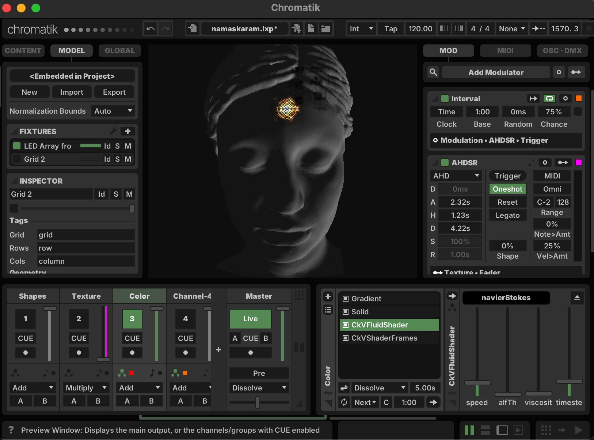

# Namaskaram

Namaskaram Burning Man Installation

A sculpture of a figure extending an Indian welcoming gesture signifying that the divine in me bows to the divine in you. Celebrating and exploring a part of everyday life, the gesture embodies many meanings, including hospitality, respect, peace, and empathy.

